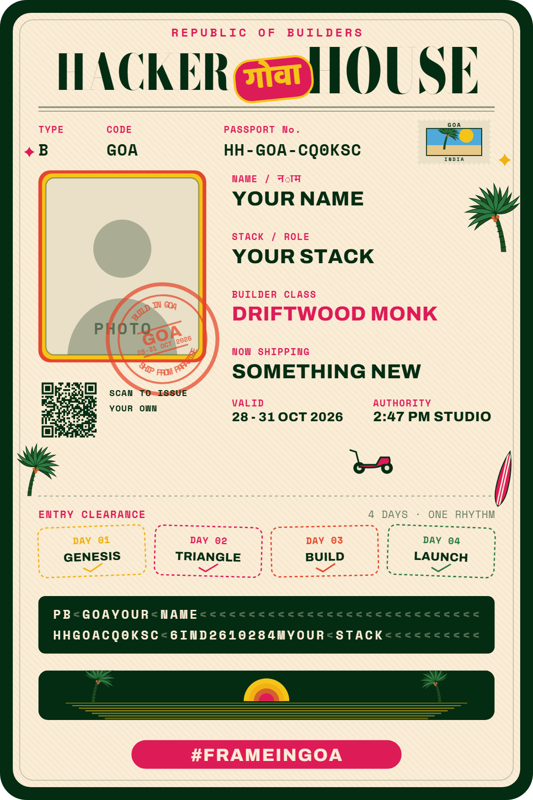

# Frame / ID Card Generator — Hacker House Goa 2026

Upload a photo, add a couple of lines, and get a branded Hacker House Goa 2026
builder ID ready to post on X. No account, no signup, no waiting.

**Live:** https://roshan5619.github.io/HH_Goa2k26_ID_Builder/



---

## What it does

1. **Upload** a photo — JPG, PNG, WebP or HEIC straight from an iPhone.
2. **Fill in** your name, stack, and what you're currently shipping. Your builder
   class and builder ID are generated for you.
3. **Watch it render** — the card redraws as you type; there is no generate step.
4. **Download** a real 1080×1620 PNG.
5. **Share to X** with the caption and `#FrameInGoa` already written in.

## How it works

The card is drawn entirely in the browser on a `<canvas>`, from vector paths
rather than image assets. That is what makes it feel instant: there is nothing to
upload and nothing to wait for, so the picture is finished by the time you have
typed your name. Your photo never leaves your device unless you deliberately
choose to share a link.

### Handling real photos

People upload whatever their camera gave them, so the intake pipeline assumes
nothing:

- **Format is sniffed from magic bytes**, not the reported MIME type. iOS
  routinely hands over HEIC files with an empty type, which is the single most
  common reason a naive uploader rejects a perfectly good iPhone photo.
- **HEIC is converted** through a decoder that is imported only when a HEIC file
  actually arrives, so its 3 MB wasm codec never touches first load for everyone
  else.
- **EXIF orientation is applied** at decode, which is what keeps iPhone
  portraits upright.
- **Crops always cover, never contain.** Panoramas, tall selfies and square
  crops all fill the circular frame without distortion or letterboxing, and you
  can drag and pinch to reposition. Where the browser exposes face detection, the
  photo is centred on the face to start with.

### Sharing that actually previews

Two paths, chosen by what the browser can do rather than by sniffing the user
agent:

- **On a phone**, the PNG is handed to the native share sheet and lands in the X
  composer as a genuine attachment. No link preview is involved, so nothing can
  render a blank thumbnail.
- **Everywhere else**, the card is uploaded to a small serverless companion that
  serves a page carrying real `og:image` tags, and the composer opens with that
  link. The PNG downloads at the same time so you can attach it directly instead.

The companion exists because static hosting fundamentally cannot do this:
crawlers fetch a URL once and never run JavaScript, so per-card metadata has to
come from the server. It is entirely optional — when it is absent or unreachable
the app falls back to attaching or downloading the image, and the flow still
completes.

## Running it locally

Requires Node 20 or newer.

```bash
npm install
npm run dev
```

The vendored brand fonts are committed, so no extra step is needed. To refresh
them from Google Fonts:

```bash
node scripts/fetch-fonts.mjs
```

## Checks

```bash
npm run typecheck   # app types
npm run lint        # eslint, zero warnings tolerated
npm test            # unit tests: crop geometry, identity generation, validation
npm run build       # production bundle
npm run e2e         # full flow against the production build
```

The end-to-end suite needs photo fixtures and a build first:

```bash
node scripts/make-fixtures.mjs
npm run build
npm run e2e
```

Fixtures are generated rather than committed, and cover the shapes that break
naive croppers: portrait, landscape, square, panorama, a tall strip, and a
deliberately tiny image.

## Layout

```
src/
  brand/tokens.ts       palette and type, sampled from the event artwork
  card/
    decode.ts           validate -> HEIC -> EXIF -> downscale
    geometry.ts         cover-fit crop maths (pure, unit tested)
    renderCard.ts       the compositor
    decor.ts            vector palms, surfboards, stamps, house, sunset
    builderClass.ts     deterministic title and ID from a name
    export.ts           PNG export and filenames
  share/                caption, native share, link upload
  ui/                   uploader, form, preview, error boundary
api/                    share service (Vercel functions)
scripts/                fonts, fixtures, screenshots, OG banner
tests/                  unit and end-to-end
```

## Deployment

**The app** deploys to GitHub Pages from `main` via
`.github/workflows/deploy.yml`. It typechecks and tests before publishing, and
stamps the version and commit SHA into the footer so any live build is traceable.

**The share service** is a separate Vercel project from the same repository —
import the repo at [vercel.com/new](https://vercel.com/new), add a Blob store,
then set a repository variable `VITE_SHARE_ORIGIN` to the resulting origin (for
example `https://your-project.vercel.app`) and re-run the deploy workflow. Until
that variable is set the app simply skips the link path.

## Design

The layout is measured from the event's reference badge rather than estimated —
the portrait ring, wordmark band and name banner sit where the printed design
puts them, and the palette is sampled from the supplied artwork. The event green
is much darker than a conventional forest green, and getting that wrong is the
quickest way to make the card read as generic.

Typography: Bodoni Moda for the wordmark (horizontally condensed to match the
event's cut), Baloo 2 for the गोवा sticker, Space Mono for labels and dates,
Archivo for the name and role banners. All four are vendored rather than linked
from a CDN, because the compositor needs deterministic font metrics before it
draws — a late-arriving webfont would silently misalign every banner.

## Accessibility and resilience

- Touch targets meet a 48 px minimum; inputs are 16 px so iOS does not zoom on
  focus.
- The canvas carries a descriptive label, and status messages use live regions.
- Errors are specific and recoverable — an unreadable file leaves the previous
  card intact, and a react error boundary catches anything that would otherwise
  white-screen the page.
- Respects `prefers-reduced-motion`.

## Event

Hacker House Goa 2026 · 28–31 Oct 2026 · Goa, India · 2:47 PM Studio
